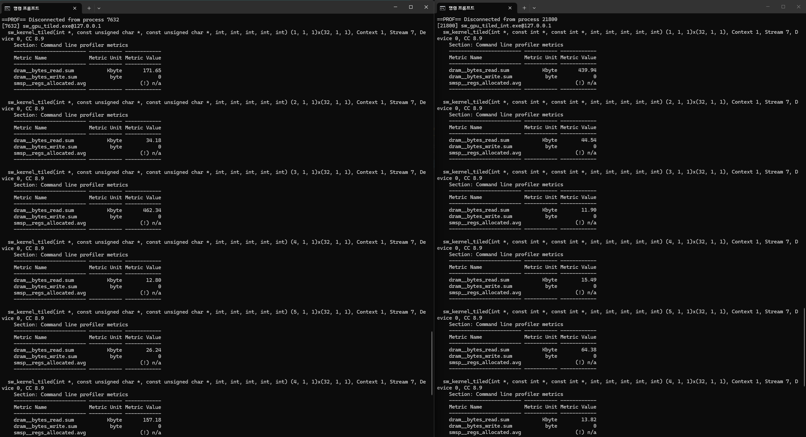

## SequenceCodec 설계 의도 : 왜 문자열 대신 정수 배열을 사용하는가?

본 프로젝트의 `SequenceCodec`은 입력된 단백질/유전체 서열의 문자(A, R, N, D...)를 0~20 사이의 1바이트 정수(`uint8_t`) 또는 표준 정수(`int`) 배열로 사전 인코딩합니다. 단순한 문자열 비교 로직을 배제하고 이러한 변환 과정을 통해 **시스템 연산 성능**을 끌어낼 수 있습니다.
성능향상의 원리는 다음과 같습니다.

### 1. 분기문 제거, $O(1)$ 직접 참조

단순 문자열 기반 매칭은 필연적으로 내부 조건문(`if (seq1 == seq2)`)을 요구합니다. 이러한 조건 분기(Branch)는 CPU의 Pipeline Stall을 유발하고, 특히 GPU 환경에서는 코어 간의 동기화를 깨뜨리는 **워프 발산**의 주범이 됩니다.
서열을 정수로 인코딩해 두면, 조건문 없이 BLOSUM62와 같은 2차원 치환 행렬의 인덱스로 즉시 매핑하여 `score_matrix[seq1[i]][seq2[j]]` 형태로 $O(1)$ 시간에 점수를 도출할 수 있습니다.

### 2. Memory Density와 Cache Hit 활용

아미노산을 ASCII 그대로 치환 행렬의 인덱스로 사용하려면, 영문자를 모두 덮을 수 있는 최소 `128 x 128` (16,384칸) 크기의 메모리 공간이 필요하며 이 중 90% 이상은 사용되지 않는 낭비 공간이 됩니다.

하지만 20개의 아미노산을 0~19의 연속된 정수로 압축(Encoding)하면, 점수 행렬을 `20 x 20` (400칸) 크기로 최적화 할 수 있습니다. 이 크기는 CPU의 L1 캐시나 GPU의 공유 메모리(Shared Memory)에 적재되어, 메인 메모리(RAM) 병목을 줄일 수 있습니다.

### 3. PCIe 대역폭 및 하드웨어 친화성

프로세서의 연산 장치(ALU)는 Text보다 Numeric 처리에 최적화되어 있습니다. 서열을 1바이트 정수(`uint8_t`) 배열로 변환함으로써 메모리 정렬의 이점을 얻을 뿐만 아니라, 향후 대용량 서열 데이터를 GPU로 복사할 때 **PCIe 버스의 Bandwidth 오버헤드를 절약**할 수 있습니다.

### [검증] 하드웨어 프로파일링 분석: uint8_t vs int

uint8_t(1바이트)와 표준 int(4바이트)를 사용했을 때 실제 메모리 효율성 차이를 증명하기 위해 Nsight Compute 프로파일러를 활용하여 DRAM 읽기량(dram\_\_bytes_read.sum)을 측정했습니다.

Figure. 1차원 Grid 1x1 커널의 DRAM Read Bytes 비교

위 사진의 커널 프로파일링 결과를 비교하면, 동일한 서열 데이터에 대해 int 대조군 버전(오른쪽)은 약 4.6배 더 많은 데이터를 글로벌 메모리(DRAM)에서 읽어들입니다.

이는 uint8_t가 int에 비해 4배 더 높은 데이터 밀도를 가지며, GPU L2/L1 캐시에 뭉텅이로 탑재(Cache Line Utilization)될 확률을 4배 높여 DRAM 대역폭 오버헤드를 근본적으로 줄였음을 증명합니다.